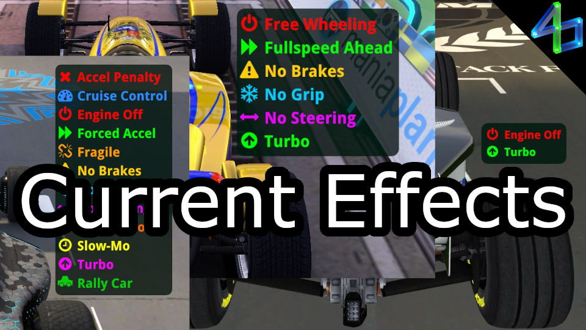

# Current Effects
The newest Trackmania has a number of special effects that can be applied to your car, including some helpers and many hinderances. It can be hard to keep track of what you currently have, especially in cases of LOL maps.

For Maniaplanet, this will display all available effects, but can't yet distinguish between turbo levels.

Showcase (older version): https://youtu.be/0rzvJQJC8gc

### Currently working:
- Cruise Control
- Engine Off (Free Wheeling in MP4)
- Forced Acceleration (Fullspeed Ahead in MP4)
- No Brakes
- No Grip
- No Steering
- Reactor Boost (yellow/red, up/down, last-second timer)
- Slow-Mo (all 4 levels)
- Turbo (all 5 levels, timer)
- Vehicle detection (Stadium/Snow/Rally)
- Editor playtest
- Playing on servers
- Detecting when user is spectating or watching a replay

### Partially working:
- Viewing replays (most effects unsupported)
- Spectating (some effects unsupported)
- Acceleration penalty (very experimental, probably wrong)
- Fragile (experimental, breaks in some instances (no pun intended))

### Not working / not implemented:
- Reactor Boost (full 6-second timer - the only reason I started this)
- Slow-Mo (timer)

## Exports
Current Effects (CE) now allows you to use it as a dependency! To do so, include "CurrentEffects" in your `info.toml`'s dependency list. In order to use these exports, call `CurrentEffects::GetState()`. This returns a `CurrentEffects::State` object which cannot be instantiated on its own, but a null handle may be initialized globally. It is safe to keep this handle around indefinitely. Don't call this function globally, rather within one of your own functions to ensure the return is not null. Within this class are all the variables you will need, and anything that is not marked as a constant can be freely modified (currently only includes 2 settings). Many variables have a type of `CurrentEffects::ActiveState` which is a shared enum. It acts like a 3-state boolean, with `-1` indicating the effect is disabled (because the user is spectating or watching a replay), `0` indicating inactive, and `1` indicating active.

### Trackmania (2020) / Maniaplanet 4
- `const ActiveState ForcedAccel` - Whether Forced Acceleration/Fullspeed Ahead is active. Does not work when watching a replay.
- `const ActiveState NoBrakes` - Whether No Brakes is active. Does not work when watching a replay.
- `const ActiveState NoEngine` - Whether Engine Off/Free Wheeling is active. Does not work when watching a replay.
- `const ActiveState NoGrip` - Whether No Grip is active. Does not work when watching a replay.
- `const ActiveState NoSteer` - Whether No Steering is active. Does not work when watching a replay.
- `const int TurboLevel` - Current level of Turbo `0 - 5` (`-1` when disabled). Does not work when spectating. (TMNEXT) Optionally cast to `VehicleState::TurboLevel`. (MP4) Only sets to `1` when active.
- `bool Experimental` - Whether experimental features are enabled.
- `bool RunWhenHidden` - Whether CE will run in the background. You should set this to `true` when using CE as a dependency.

### Trackmania (2020)-specific
- `const ActiveState AccelPenalty` - (Experimental, probably wrong) Whether Acceleration Penalty is active. Does not work when spectating or watching a replay.
- `const ActiveState CruiseControl` - Whether Cruise Control is active. Does not work when spectating.
- `const ActiveState Fragile` - (Experimental) Whether Fragile is active. Does not work when watching a replay or spectating.
- `const float ReactorBoostFinalTimer` - Timer that counts from `0.0 - 1.0` in the final second of Reactor Boost. Does not work when watching a replay.
- `const ESceneVehicleVisReactorBoostLvl ReactorBoostLevel` - Current level of Reactor Boost.
- `const ESceneVehicleVisReactorBoostType ReactorBoostType` - Current type of Reactor Boost.
- `const int SlowMoLevel` - Current level of Slow-Mo `0 - 4`.
- `const bool Spectating` - Whether the user is spectating another player.
- `const float TurboTime` - Timer that counts from `0.0 - 1.0` as Turbo is running out. Does not work when spectating.
- `const int Vehicle` - Current vehicle type (Stadium `0`, Snow `1`, Rally `2`). Optionally cast to `VehicleState::VehicleType` (once available).
- `const bool WatchingReplay` - Whether the user is watching a replay.

There are several more exported functions available, but they are deprecated and will be removed in a future update. As such, they are no longer documented. If you are already using these, switch to the new method of using `CurrentEffects::GetState()`.

