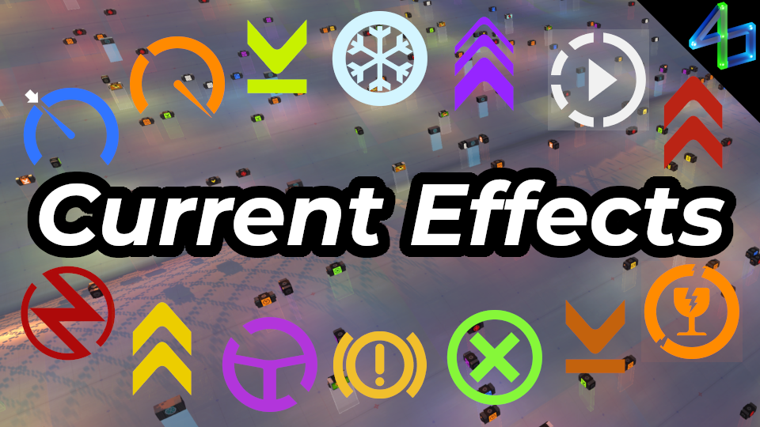

# Current Effects
So many things can affect your car, ranging from an effect that kills your engine to one that makes you fly. It can be hard to keep track of it all, and now you don't have to! With a little window on your screen, you get a comprehensive overview of the things you need to worry about.
- "Did I actually touch that fragile block?"
- "When is my reactor going to run out?"
- "How wet am I?"

Not all statuses (the things we track) are available everywhere. Refer to the chart below to see what is and where. If you're a developer and want to add a checkmark somewhere, human-written PRs are always welcome.

|status              |solo|replay|server|spectate|tm2 solo|tm2 server|tm2 spectate|turbo solo|turbo server|turbo spectate
|:-:                 |:-: |:-:   |:-:   |:-:     |:-:     |:-:       |:-:         |:-:       |:-:         |:-:
|action key          |✅|❌|✅|❌|❌|❌|❌|❌|❌|❌
|brake pedal         |✅|❌|✅|❌|❌|❌|❌|❌|❌|❌
|camera              |✅|❌|✅|✅|⚠️|⚠️|✅|✅|✅|❌
|checkpoint number   |✅|❌|✅|✅|✅|✅|✅|✅|✅|❌
|checkpoint times    |✅|❌|✅|❌|✅|✅|✅|✅|✅|❌
|cruise control      |✅|✅|✅|✅|❌|❌|❌|❌|❌|❌
|cruise control speed|✅|✅|✅|✅|❌|❌|❌|❌|❌|❌
|driving             |✅|✅|✅|✅|✅|✅|✅|✅|✅|❌
|engine off          |✅|❌|✅|✅|✅|✅|❌|✅|✅|❌
|entity id           |✅|✅|✅|✅|✅|✅|✅|❌|❌|❌
|exe version         |✅|✅|✅|✅|✅|✅|✅|✅|✅|✅
|finished            |✅|✅|✅|✅|✅|✅|✅|✅|✅|❌
|forced acceleration |✅|❌|✅|✅|✅|✅|❌|❌|❌|❌
|fragile             |✅|⚠️|✅|⚠️|❌|❌|❌|❌|❌|❌
|fragile damage      |✅|❌|✅|❌|❌|❌|❌|❌|❌|❌
|framerate           |✅|✅|✅|✅|✅|✅|✅|❌|❌|❌
|game mode           |✅|✅|✅|✅|✅|✅|✅|✅|✅|✅
|ghost visibility    |✅|✅|✅|✅|✅|✅|✅|✅|✅|✅
|lap number          |✅|❌|✅|✅|✅|✅|✅|✅|✅|❌
|lap times           |✅|❌|✅|❌|✅|✅|✅|✅|✅|❌
|launch respawning   |✅|❌|✅|❌|❌|❌|❌|❌|❌|❌
|login               |✅|❌|✅|✅|✅|✅|✅|✅|✅|❌
|map checkpoint count|✅|✅|✅|✅|✅|✅|✅|✅|✅|❌
|map lap count       |✅|✅|✅|✅|✅|✅|✅|✅|✅|❌
|map type            |✅|✅|✅|✅|✅|✅|✅|✅|✅|✅
|map uid             |✅|✅|✅|✅|✅|✅|✅|✅|✅|✅
|map waypoint count  |✅|✅|✅|✅|✅|✅|✅|✅|✅|❌
|name                |✅|✅|✅|✅|✅|✅|✅|✅|✅|❌
|nametag visibility  |✅|✅|✅|✅|✅|✅|✅|❌|❌|❌
|no brakes           |✅|❌|✅|✅|✅|✅|❌|❌|❌|❌
|no grip             |✅|❌|✅|✅|✅|✅|❌|❌|❌|❌
|no steering         |✅|❌|✅|✅|✅|✅|❌|❌|❌|❌
|opponent visibility |✅|✅|✅|✅|✅|✅|✅|❌|❌|❌
|pause menu shown    |✅|✅|✅|✅|✅|✅|✅|✅|✅|✅
|ping                |❌|❌|✅|✅|❌|✅|✅|❌|✅|✅
|quit overlay        |✅|✅|✅|✅|❌|❌|❌|❌|❌|❌
|race time           |✅|❌|✅|✅|✅|✅|✅|✅|✅|❌
|reactor             |✅|✅|✅|✅|❌|❌|❌|❌|❌|❌
|reactor duration    |✅|❌|✅|❌|❌|❌|❌|❌|❌|❌
|reactor final timer |✅|❌|✅|✅|❌|❌|❌|❌|❌|❌
|reactor level       |✅|✅|✅|✅|❌|❌|❌|❌|❌|❌
|reactor remaining   |✅|❌|✅|❌|❌|❌|❌|❌|❌|❌
|reactor type        |✅|✅|✅|✅|❌|❌|❌|❌|❌|❌
|respawn duration    |✅|❌|✅|❌|❌|❌|❌|❌|❌|❌
|respawn end tick    |✅|❌|✅|❌|❌|❌|❌|❌|❌|❌
|respawning          |✅|❌|✅|❌|❌|❌|❌|❌|❌|❌
|respawn remaining   |✅|❌|✅|❌|❌|❌|❌|❌|❌|❌
|respawns            |✅|❌|✅|✅|✅|✅|✅|✅|✅|❌
|settings overlay    |✅|✅|✅|✅|❌|❌|❌|❌|❌|❌
|sequence            |✅|✅|✅|✅|✅|✅|✅|✅|✅|✅
|slow-mo             |✅|✅|✅|✅|❌|❌|❌|❌|❌|❌
|slow-mo coefficient |✅|✅|✅|✅|❌|❌|❌|❌|❌|❌
|slow-mo duration    |⚠️|❌|⚠️|❌|❌|❌|❌|❌|❌|❌
|slow-mo level       |✅|✅|✅|✅|❌|❌|❌|❌|❌|❌
|slow-mo remaining   |✅|❌|✅|❌|❌|❌|❌|❌|❌|❌
|spawning            |✅|✅|✅|✅|✅|✅|✅|✅|✅|❌
|stand respawning    |✅|❌|✅|❌|❌|❌|❌|❌|❌|❌
|start tick          |✅|❌|✅|✅|✅|✅|✅|✅|✅|❌
|ticks               |✅|✅|✅|✅|✅|✅|✅|✅|✅|✅
|titlepack           |✅|✅|✅|✅|✅|✅|✅|✅|✅|✅
|turbo               |✅|✅|✅|❌|✅|✅|❌|✅|✅|❌
|turbo level         |✅|✅|✅|❌|❌|❌|❌|❌|❌|❌
|turbo timer         |✅|✅|✅|❌|✅|✅|❌|✅|✅|❌
|vehicle type        |✅|✅|✅|✅|✅|✅|⚠️|✅|✅|✅
|water               |✅|✅|✅|❌|❌|❌|❌|❌|❌|❌
|waypoint count      |✅|❌|✅|✅|✅|✅|✅|✅|✅|❌
|waypoint times      |✅|❌|✅|❌|✅|✅|✅|✅|✅|❌
|web services id     |✅|❌|✅|✅|❌|❌|❌|❌|❌|❌

- ⚠️ mediatracker-locked cameras are not detected in tm2
- ⚠️ when watching a replay or spectating, fragile only appears if at least one tire is partially worn
- ⚠️ when switching to/from alt cars, slow-mo duration may be wrong
- ⚠️ when spectating in envimix, vehicle type may be wrong

## Exports
`CurrentEffects` has a number of exports for you to use in your own plugins. When using these, it's important to note that CE is updated on the render loop, not the simulation loop.

Plugin version 1.1 is planned to have a much more extensive export system so stay tuned!

### Functions (all games)
```asc
// the current camera
Camera StatusCamera();

// times of taken checkpoints on the current lap, referencing the start of the lap
uint[] StatusCheckpointLapTimes();

// number of checkpoints taken
uint StatusCheckpointNumber();

// time spent on the current checkpoint
uint StatusCheckpointTime();

// times of taken checkpoints on the current lap
uint[] StatusCheckpointTimes();

// player is driving
bool StatusDriving();

// executable version of the game
string StatusExeVersion();

// player is finished
bool StatusFinished();

// framerate
float StatusFps();

// game mode
string StatusGameMode();

// running time of the playground to the 0.001s
uint StatusGameTime();

// ghosts are visible
bool StatusGhosts();

// times of finished laps, referencing the start of the lap
uint[] StatusLapLapTimes();

// number of the current lap
uint StatusLapNumber();

// time spent on the current lap
uint StatusLapTime();

// times of finished laps
uint[] StatusLapTimes();

// time of last lap finished
uint StatusLastLapTime();

// time of the last waypoint taken
uint StatusLastWaypointTime();

// login of the player
string StatusLogin();

// number of collectable checkpoints in the map
uint StatusMapCheckpointCount();

// number of laps in the map
uint StatusMapLapCount();

// game-generated unique ID of the current map
string StatusMapUid();

// number of collectable waypoints in the map
uint StatusMapWaypointCount();

// maximum framerate specified by game settings
uint StatusMaxFps();

// name of the player
string StatusName();

// engine off/free wheeling effect is active
bool StatusNoEngine();

// race time of the player to the 0.001s
uint StatusRaceTime();

// number of respawns
uint StatusRespawns();

// current UI sequence
CGamePlaygroundUIConfig::EUISequence StatusSequence();

// the player is spawning at the start of the race
bool StatusSpawning();

// start tick of the player
uint StatusStartTick();

// number of ticks simulated in the playground
uint StatusTicks();

// turbo effect is active
bool StatusTurbo();

// amount of time with turbo left, but not always in seconds
float StatusTurboTimer();

// the current vehicle type (stadium, canyon, etc.)
VehicleType StatusVehicleType();

// the current view mode (solo, spectating, etc.)
ViewMode StatusViewMode();

// number of waypoints taken
uint StatusWaypointCount();

// times of collected waypoints
uint[] StatusWaypointTimes();
```

### Functions (TM2020)
```asc
// the plugin is running, whether or not it's safe
bool Running();

// it is safe to run the plugin with the current game version
bool Safe();

// the current action key
uint8 StatusActionKey();

// brake pedal is held
bool StatusBrakePedal();

// cruise control effect is active
bool StatusCruiseControl();

// front speed locked by cruise control
float StatusCruiseControlSpeed();

// fragile effect is active
bool StatusFragile();

// car is doing a launched respawn
bool StatusLaunchRespawning();

// reactor effect is active
bool StatusReactor();

// reactor ticks given
uint StatusReactorDuration();

// ticks of reactor used
uint StatusReactorElapsed();

// timer counts from 0.0-1.0 in final second of reactor
float StatusReactorFinalTimer();

// level of reactor
ESceneVehicleVisReactorBoostLvl StatusReactorLevel();

// when reactor started
uint StatusReactorStartTick();

// reactor ticks left
uint StatusReactorRemaining();

// type of reactor
ESceneVehicleVisReactorBoostType StatusReactorType();

// how long respawning takes
uint StatusRespawnDuration();

// when the current respawn ends
uint StatusRespawnEndTick();

// car is respawning
bool StatusRespawning();

// respawn ticks left
uint StatusRespawnRemaining();

// slow-mo effect is active
bool StatusSlowMo();

// time factor used by slow-mo
float StatusSlowMoCoefficient();

// slow-mo ticks given
uint StatusSlowMoDuration();

// when slow-mo ends
uint StatusSlowMoEndTick();

// level of slow-mo
uint8 StatusSlowMoLevel();

// slow-mo ticks left
uint StatusSlowMoRemaining();

// car is doing a standing respawn
bool StatusStandRespawning();

// level of turbo
uint StatusTurboLevel();

// percentage of wetness
float StatusWater();

// online ID of the player
string StatusWebServicesUserId();
```

### Functions (MP4)
```asc
// spectating target mode is set to automatic
bool StatusSpectateAuto();
```

### Functions (TM2020/MP4)
```asc
// the ID of the entity we're looking at
uint StatusEntityId();

// forced accel/fullspeed ahead effect is active
bool StatusForcedAcceleration();

// nametags are visible
bool StatusNametags();

// no brakes effect is active
bool StatusNoBrakes();

// no grip effect is active
bool StatusNoGrip();

// no steering effect is active
bool StatusNoSteering();

// opponents are transparent, opaque, or off
OpponentVis StatusOpponents();
```

### Enums
```asc
enum Camera {
    Unknown = -1,
    Cam1,
    Alt1,
    Cam2,
    Alt2,
    Cam3,
    Alt3,
    Cam7,
    Alt7,
    Backwards,
    SpecFollow,
    SpecFollowAll,
    SpecFree,
    SpecReplay,
}

enum OpponentVis {
    Unknown     = -1,
    Off         = 0,
    Transparent = 1,
    Opaque      = 2,
}

enum VehicleType {
    Unknown = -1,
    Snow,
    Desert,
    Rally,
    Island,
    Bay,
    Coast,
    Stadium,
    Canyon,
    Human,
    Valley,
    Lagoon,
    Traffic,
}

enum ViewMode {
    Unknown     = -1,
    Solo        = 0x1,
    Replay      = 0x2,
    Server      = 0x4,
    Spectate    = 0x8,
    SplitScreen = 0x10,
}
```

## Thank You

I want to give a special thank you to the following developers who have given me great insight and assistance on this project. Without their research and help in testing, this plugin would be a shell of what it is now.
- Miss
- XertroV
- achepta
- druduche
- Fort
- Manama
