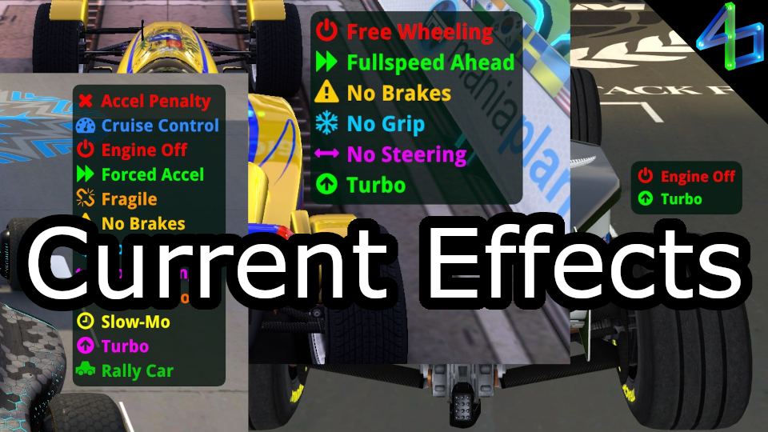

# Current Effects
So many things can affect your car. So many things. Use this as a dependency if you want static, non-event-based details about the vehicle being looked at. Or just use it as it is, a little window that shows you everything you need to know.

I want to give a special thank you to the following developers who have given me great insight and assistance on this project. Without their help, much of the chart below would not be filled in and I am very grateful.
- Miss
- XertroV
- achepta
- druduche
- Fort
- Manama

|status              |solo|replay|server|spectate|tm2 solo|tm2 server|tm2 spectate|turbo solo|turbo server|turbo spectate
|:-:                 |:-: |:-:   |:-:   |:-:     |:-:     |:-:       |:-:         |:-:       |:-:         |:-:
|action key          |✅|❌|✅|❌|❌|❌|❌|❌|❌|❌
|camera              |✅|❌|✅|✅|✅|✅|✅|✅|✅|❌
|cruise control      |✅|✅|✅|✅|❌|❌|❌|❌|❌|❌
|cruise control speed|✅|✅|✅|✅|❌|❌|❌|❌|❌|❌
|driving             |✅|✅|✅|❌|✅|✅|✅|✅|✅|❌
|engine off          |✅|❌|✅|✅|✅|✅|❌|✅|✅|❌
|entity id           |✅|✅|✅|✅|✅|✅|✅|❌|❌|❌
|finished            |✅|✅|✅|❌|✅|✅|✅|✅|✅|❌
|forced acceleration |✅|❌|✅|✅|✅|✅|❌|❌|❌|❌
|fragile             |✅|⚠️|✅|⚠️|❌|❌|❌|❌|❌|❌
|fragile damage      |✅|❌|✅|❌|❌|❌|❌|❌|❌|❌
|game mode           |✅|✅|✅|✅|✅|✅|✅|✅|✅|✅
|ghost visibility    |✅|✅|✅|✅|✅|✅|✅|✅|✅|✅
|launch respawning   |✅|❌|✅|❌|❌|❌|❌|❌|❌|❌
|login               |✅|❌|✅|✅|✅|✅|✅|✅|✅|❌
|name                |✅|✅|✅|✅|✅|✅|✅|✅|✅|❌
|nametag visibility  |✅|✅|✅|✅|✅|✅|✅|❌|❌|❌
|no brakes           |✅|❌|✅|✅|✅|✅|❌|❌|❌|❌
|no grip             |✅|❌|✅|✅|✅|✅|❌|❌|❌|❌
|no steering         |✅|❌|✅|✅|✅|✅|❌|❌|❌|❌
|opponent visibility |✅|✅|✅|✅|✅|✅|✅|❌|❌|❌
|reactor             |✅|✅|✅|✅|❌|❌|❌|❌|❌|❌
|reactor duration    |✅|❌|✅|❌|❌|❌|❌|❌|❌|❌
|reactor final timer |✅|❌|✅|✅|❌|❌|❌|❌|❌|❌
|reactor level       |✅|✅|✅|✅|❌|❌|❌|❌|❌|❌
|reactor remaining   |✅|❌|✅|❌|❌|❌|❌|❌|❌|❌
|reactor type        |✅|✅|✅|✅|❌|❌|❌|❌|❌|❌
|respawning          |✅|❌|✅|❌|❌|❌|❌|❌|❌|❌
|respawns            |✅|❌|✅|✅|✅|✅|✅|✅|✅|❌
|sequence            |✅|✅|✅|✅|✅|✅|✅|✅|✅|✅
|slow-mo             |✅|✅|✅|✅|❌|❌|❌|❌|❌|❌
|slow-mo coefficient |✅|✅|✅|✅|❌|❌|❌|❌|❌|❌
|slow-mo duration    |⚠️|❌|⚠️|❌|❌|❌|❌|❌|❌|❌
|slow-mo level       |✅|✅|✅|✅|❌|❌|❌|❌|❌|❌
|slow-mo remaining   |✅|❌|✅|❌|❌|❌|❌|❌|❌|❌
|spawning            |✅|✅|✅|✅|✅|✅|✅|✅|✅|❌
|stand respawning    |✅|❌|✅|❌|❌|❌|❌|❌|❌|❌
|start tick          |✅|❌|✅|✅|✅|✅|✅|✅|✅|❌
|ticks               |✅|✅|✅|✅|✅|✅|✅|✅|✅|✅
|turbo               |✅|✅|✅|❌|✅|✅|❌|✅|✅|❌
|turbo level         |✅|✅|✅|❌|❌|❌|❌|❌|❌|❌
|turbo timer         |✅|✅|✅|❌|✅|✅|❌|✅|✅|❌
|vehicle type        |✅|✅|✅|✅|⚠️|⚠️|⚠️|✅|✅|✅
|web services id     |✅|❌|✅|✅|❌|❌|❌|❌|❌|❌
|water               |✅|✅|✅|❌|❌|❌|❌|❌|❌|❌

\* when watching a replay or spectating, fragile only appears if at least one tire is partially worn

\* when switching to/from alt cars, slow-mo duration may be wrong

\* vehicle type is probably wrong in envimix

